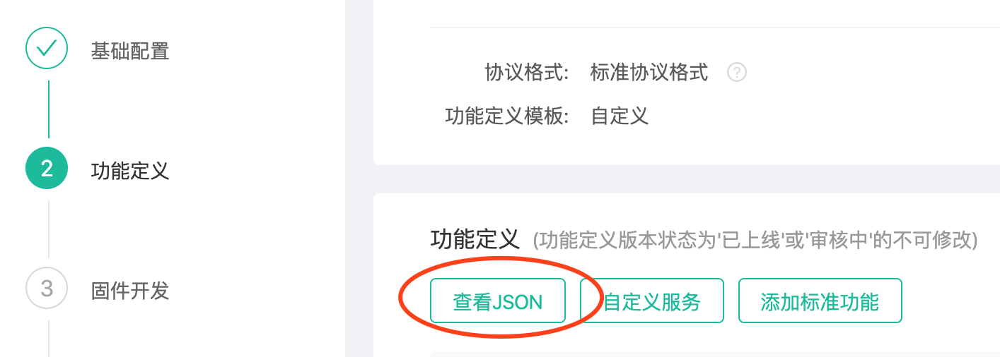

## 将spec协议的json转换为文件
将米家spec协议转换成id和name互相映射的文件，以及常量导出文件

### 输入输出文件

输入：米家spec协议json文件，可以从小米IoT开发者后台的功能定义中获取。



输出：prtocal.js（id和name互相映射）以及SpecConst.js（常量导出）

```js
// protocal.js
export default {
  action: {
    brightnessUp: {
      aiid: 1, 
      siid: 2
    }, 
  }, 
  event: {
    3.1: 'lowBattery', 
    lowBattery: {
      eiid: 1, 
      siid: 3
    }
  }, 
  prop: {
    2.1: 'on', 
    2.3: 'brightness', 
    brightness: {
      piid: 3, 
      siid: 2
    }, 
    on: {
      piid: 1, 
      siid: 2
    }, 
  }
}

// SpecConst.js

const PROP = {
  BRIGHTNESS: 'brightness', 
  ON: 'on', 
}
const ACTION = {
  BRIGHTNESS_UP: 'brightnessUp', 
}
const EVENT = {
  LOW_BATTERY: 'lowBattery'
}
export default { PROP, ACTION, EVENT };
```

### 使用

```shell
./specParse.py ./example/light.json
```

默认会转换所有的配置信息，在当前目录下输出所有的生成文件

#### 参数
生成文件的时候，如果希望过滤掉某些prop、event、action，可以指定过滤规则，支持正则表达式。也可以指定文件输出的路劲

+ -p 指定需要过滤的prop
+ -e 指定需要过滤的event
+ -a 指定需要过滤的action
+ -o 指定输出文件的目录

```shell
./specParse.py ./example/light.json -p '1.*' -a '2.[4-8]' -e '*.*' -o './dist'
```

上面的命令代表将example下的light.json文件进行转换，过滤掉1开始的prop，2.4到2.8的action，以及所有的event，最终输出到dist目录中

#### 使用配置文件

命令可以通过`-c`指定配置文件，来进行解析

```shell
./specParse.py ./example/light.json - c ./config.json
```

配置文件内容例子：

```json
{
  "propFilter": "(1.*)|(2.[2|4|5])|(4.[2-5])|(4.1[2-8])",
  "eventFilter": "4.*",
  "actionFilter": "(2.[1-2])|(4.[1|6|7])",
  "outPath": "./"
}
```
